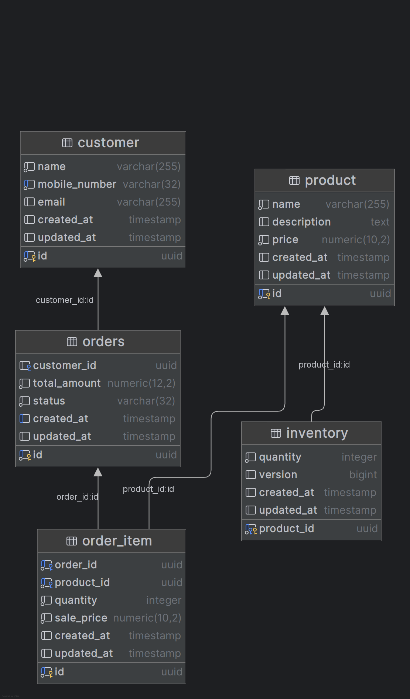

# XYZ Retail — Backend API

A production-ready REST API for **XYZ Retail Company** built with **Java 21** and **Spring Boot 3.2**. The application enables customers to browse products, manage shopping carts, and place orders online. It also exposes management and employee reporting endpoints for sales and inventory insights.

---

## Table of Contents

- [Requirements](#requirements)
- [How to Run](#how-to-run)
  - [Hosted Version](#1-hosted-version)
  - [Docker Compose](#2-docker-compose)
  - [Run the Backend Manually](#3-run-the-backend-manually)
  - [Database Setup (Options 2 & 3)](#database-setup-options-2--3)
- [API Reference](#api-reference)
  - [Customer APIs](#customer-apis)
  - [Employee APIs](#employee-apis)
  - [Management / Reporting APIs](#management--reporting-apis)
- [Architecture & Technical Documentation](#architecture--technical-documentation)
  - [Project Structure](#project-structure)
  - [Hexagonal Architecture](#hexagonal-architecture)
  - [Domain Model](#domain-model)
  - [Database](#database)
  - [Email Notifications (SendGrid)](#email-notifications-sendgrid)
  - [Resilience (Circuit Breaker & Retry)](#resilience-circuit-breaker--retry)
  - [Error Handling](#error-handling)
  - [Testing](#testing)
  - [Code Quality & Coverage](#code-quality--coverage)
- [Configuration Reference](#configuration-reference)
- [Tech Stack](#tech-stack)

---

## Requirements

| Requirement      | Version / Details          |
|------------------|----------------------------|
| **Java (JDK)**   | 21+                        |
| **Gradle**       | 9.x (wrapper included)     |
| **PostgreSQL**   | 12+ (running on port 5432) |
| **Docker** *(optional)* | For containerised runs |

> The Gradle wrapper (`gradlew` / `gradlew.bat`) is included in the repository so a separate Gradle installation is not required.

### Database Setup

You could create a database locally, but I would recommend just running the Docker Compose setup (see [How to Run](#how-to-run)) which includes a PostgreSQL container. If you prefer to set up the database manually, create a new database named `xyz_retail`:

```sql
CREATE DATABASE xyz_retail;
```

The schema and seed data are provided as SQL migration scripts in `src/main/resources/db/migration/`:

| Script | Purpose |
|--------|---------|
| `V1__init_schema.sql` | Creates tables: `product`, `inventory`, `customer`, `orders`, `order_item` with indices and constraints |
| `V2__seed_products_inventory.sql` | Seeds 50+ products and their inventory quantities |

> I tried to add Flyway, but I ran into some issues. With IntelliJ IDEA you can just right-click on the SQL files and run them against your database.

---

## How to Run

There are **3 ways** to see this application in action:

| # | Method | Description |
|---|--------|-------------|
| 1 | [Hosted version](#1-hosted-version) | Visit the live deployment — no setup required |
| 2 | [Docker Compose](#2-docker-compose) | Run the full stack locally with one command |
| 3 | [Run manually](#3-run-the-backend-manually) | Build & run the Spring Boot app yourself |

> For options 2 and 3 you will need to apply the database migration scripts (see [Database Setup](#database-setup-options-2--3) below).

---

### 1. Hosted Version

The easiest way — simply visit:

> **[https://xyz.irfanbilir.nl](https://xyz.irfanbilir.nl)**

The hosted environment already contains seed data (50 products with inventory), so you can start browsing and placing orders right away.

---

### 2. Docker Compose

A `docker-compose.yml` is available in the **parent folder** of this project. It spins up the backend together with a PostgreSQL database and the frontend.

```bash
# From the parent directory of this project (root of the github repository)
cd ..
docker-compose up -d
```

After the containers are running, apply the database migrations (see below) and the API will be available at **`http://localhost:8090`**.

---

### 3. Run the Backend Manually

1. **Clone the repository**
   ```bash
   git clone <repository-url>
   cd backend
   ```

2. **Configure the database** — edit `src/main/resources/application.properties` if your PostgreSQL credentials differ from the defaults:
   ```properties
   spring.datasource.url=jdbc:postgresql://localhost:5432/xyz_retail
   spring.datasource.username=not_root_user
   spring.datasource.password=top_secret_password
   ```

3. **Build & run**
   ```bash
   ./gradlew bootRun
   ```
   On Windows:
   ```powershell
   .\gradlew.bat bootRun
   ```

4. The API will be available at **`http://localhost:8090`**.

---

### Database Setup (Options 2 & 3)
> Not needed anymore. Managed to get flyway working so migrations happen autoamtically.
---

### Running Tests

```bash
./gradlew test
```

Code coverage reports (JaCoCo) are generated at `build/reports/jacoco/test/html/index.html`.

---

## API Reference

Base URL: `http://localhost:8090`

### Customer APIs

#### Search Products

```
GET /api/products/search?q={query}
```

Search products by name (case-insensitive partial match).

| Parameter | Type   | Required | Description               |
|-----------|--------|----------|---------------------------|
| `q`       | string | Yes      | Search keyword for product name |

**Response** `200 OK` — `List<ProductResponse>`

```json
[
  {
    "id": "11111111-1111-1111-1111-111111111001",
    "name": "Banana (1kg)",
    "description": "Ripe yellow bananas, ideal for snacks and smoothies.",
    "price": 2.49,
    "inventory": {
      "quantity": 100,
      "lowStock": false
    }
  }
]
```

---

#### Create Cart

```
POST /api/orders
```

Creates a new empty shopping cart (order with status `CREATED`).

**Response** `201 Created` — `OrderResponse`

```json
{
  "id": "a1b2c3d4-...",
  "status": "CREATED",
  "totalAmount": 0,
  "customer": null,
  "items": []
}
```

---

#### Add Item to Cart

```
POST /api/orders/{orderId}/items
```

| Parameter   | Type | Required | Description          |
|-------------|------|----------|----------------------|
| `orderId`   | UUID | Yes      | Path — the cart/order ID |

**Request Body**

```json
{
  "productId": "11111111-1111-1111-1111-111111111001",
  "quantity": 3
}
```

**Response** `200 OK` — `OrderResponse` with updated items and total.

---

#### Place Order

```
POST /api/orders/{orderId}/place
```

Finalises the cart. Customer name and mobile number are **mandatory**. Providing an email triggers a confirmation email via SendGrid.

**Request Body**

```json
{
  "customerName": "John Doe",
  "mobileNumber": "+31612345678",
  "email": "john.doe@example.com"
}
```

**Response** `200 OK` — `OrderResponse` with status `PLACED` and the assigned customer.

---

### Employee APIs

#### Look Up Order by ID

```
GET /api/employee/orders/{orderId}
```

Retrieve full order details including items and customer info.

**Response** `200 OK` — `OrderResponse`

---

### Management / Reporting APIs

All reporting responses include: product name, price, quantity available, low-stock indicator (`quantity < 10`), and quantity sold.

#### Top 5 Selling Products of the Day

```
GET /api/management/reports/top-selling?date={yyyy-MM-dd}
```

| Parameter | Type       | Required | Description                          |
|-----------|------------|----------|--------------------------------------|
| `date`    | LocalDate  | No       | Defaults to today if omitted         |

**Response** `200 OK` — `List<ProductSalesResponse>`

```json
[
  {
    "name": "Banana (1kg)",
    "price": 2.49,
    "quantityAvailable": 87,
    "lowStock": false,
    "quantitySold": 42
  }
]
```

---

#### Least Selling Products of the Month

```
GET /api/management/reports/least-selling?month={yyyy-MM}
```

| Parameter | Type      | Required | Description                            |
|-----------|-----------|----------|----------------------------------------|
| `month`   | YearMonth | No       | Defaults to current month if omitted   |

**Response** `200 OK` — `List<ProductSalesResponse>`

---

#### Sales Amount per Day (Custom Date Range)

```
GET /api/management/reports/sales?start={yyyy-MM-dd}&end={yyyy-MM-dd}
```

| Parameter | Type      | Required | Description       |
|-----------|-----------|----------|-------------------|
| `start`   | LocalDate | Yes      | Start date (inclusive) |
| `end`     | LocalDate | Yes      | End date (inclusive)   |

**Response** `200 OK` — `List<SalesPerDayResponse>`

```json
[
  { "day": "2026-02-25", "totalSales": 1250.00 },
  { "day": "2026-02-26", "totalSales": 980.50 }
]
```

---

## Architecture & Technical Documentation

### Project Structure

The application follows a **layered hexagonal (ports & adapters) architecture**:

```
src/main/java/org/brightinhere/xyz_retail/
├── domain/                         # Core domain entities & business rules
│   ├── BaseEntity.java             # Audit fields (createdAt, updatedAt)
│   ├── Product.java
│   ├── Inventory.java              # Optimistic locking via @Version
│   ├── Customer.java
│   ├── Order.java                  # State transitions (CREATED → PLACED)
│   ├── OrderItem.java
│   └── OrderStatus.java
│
├── application/                    # Application / use-case layer
│   ├── dto/                        # Response & request DTOs (Java records)
│   │   ├── request/
│   │   │   ├── AddItemRequest.java
│   │   │   └── PlaceOrderRequest.java
│   │   ├── OrderResponse.java
│   │   ├── ProductResponse.java
│   │   ├── ProductSalesResponse.java
│   │   ├── SalesPerDayResponse.java
│   │   ├── InventoryResponse.java
│   │   ├── CustomerResponse.java
│   │   ├── OrderItemResponse.java
│   │   └── ErrorResponse.java
│   ├── mapper/                     # Domain ↔ DTO mappers
│   ├── port/                       # Inbound/outbound port interfaces
│   │   ├── ProductRepository.java
│   │   ├── OrderRepository.java
│   │   ├── CustomerRepository.java
│   │   ├── InventoryRepository.java
│   │   ├── ReportingRepository.java
│   │   └── EmailSender.java
│   └── service/                    # Business logic / use-case orchestration
│       ├── ProductService.java
│       ├── OrderService.java
│       ├── InventoryService.java
│       └── ReportingService.java
│
└── infrastructure/                 # Adapters (framework-specific implementations)
    ├── config/
    │   ├── AsyncConfig.java        # @EnableAsync for non-blocking email
    │   ├── CorsConfig.java         # Global CORS filter
    │   └── SendGridConfig.java     # SendGrid client bean
    ├── exception/
    │   ├── GlobalExceptionHandler.java   # @RestControllerAdvice
    │   └── ... custom exceptions
    ├── notification/
    │   └── SendGridEmailSender.java      # EmailSender port adapter
    ├── persistence/
    │   ├── jpa/                    # Spring Data JPA repository interfaces
    │   └── repositories/           # Port → JPA adapter implementations
    └── web/                        # REST controllers
        ├── ProductController.java
        ├── OrderController.java
        ├── EmployeeOrderController.java
        └── ManagementReportController.java
```

### Hexagonal Architecture

The codebase separates **domain logic** from **infrastructure concerns**:

| Layer | Responsibility |
|-------|---------------|
| **Domain** | Pure entities with business rules (e.g. `Inventory.deduct()`, `Order.place()`). No framework annotations beyond JPA. |
| **Application** | Orchestrates use cases, defines port interfaces (repositories, email sender), and DTOs/mappers. |
| **Infrastructure** | Implements port interfaces using Spring Data JPA, SendGrid SDK, and exposes REST controllers. |

This design ensures the domain layer has **zero coupling** to web or persistence frameworks and can be tested in isolation.

### Domain Model


**Key business rules:**
- An order starts in `CREATED` status (cart phase) and transitions to `PLACED` on checkout.
- Placing an order requires a non-empty cart, a customer name, and a mobile number.
- Inventory is deducted atomically on order placement with **optimistic locking** (`@Version`) to prevent overselling under concurrent requests.
- Low-stock indicator is flagged when inventory quantity drops below **10**.

### Database

- **Engine:** PostgreSQL
- **ORM:** Hibernate / Spring Data JPA with `ddl-auto=validate` (schema managed via migration scripts).
- **Schema migrations:** SQL scripts in `src/main/resources/db/migration/`.

### Email Notifications (SendGrid)

When an order is placed with a valid email address, a confirmation email is sent asynchronously via the **SendGrid** API using dynamic templates.

- Email sending is **non-blocking** (`@Async`) so it does not slow down the order response.
- Configured via `sendgrid.api-key`, `app.email.from`, and `app.email.template.order-confirmation` in `application.properties`.

### Resilience (Circuit Breaker & Retry)

Email delivery is wrapped with **Resilience4j**:

| Pattern | Configuration |
|---------|--------------|
| **Retry** | Max 3 attempts, 1s initial wait, exponential backoff (multiplier 2) |
| **Circuit Breaker** | Sliding window of 10 calls, opens at 50% failure rate, 30s open-state wait, 3 calls in half-open |

If the email service is unavailable, the circuit breaker prevents cascading failures. A fallback method logs the failure without impacting the order flow.

### Error Handling

A global `@RestControllerAdvice` (`GlobalExceptionHandler`) maps domain exceptions to structured JSON error responses:

| Exception | HTTP Status | Error Code |
|-----------|-------------|------------|
| `OrderNotFoundException` | 404 | `ORDER_NOT_FOUND` |
| `ProductNotFoundException` | 404 | `PRODUCT_NOT_FOUND` |
| `InventoryNotFoundException` | 404 | `INVENTORY_NOT_FOUND` |
| `InsufficientStockException` | 409 | `INSUFFICIENT_STOCK` |
| `InvalidOrderStateException` | 409 | `INVALID_ORDER_STATE` |
| `MethodArgumentNotValidException` | 400 | `VALIDATION_ERROR` |

**Error response format:**

```json
{
  "timestamp": "2026-02-28T12:00:00",
  "status": 404,
  "error": "ORDER_NOT_FOUND",
  "message": "Order not found",
  "path": "/api/employee/orders/abc"
}
```

### Testing

The project has comprehensive unit tests across all layers:

| Layer | Tests |
|-------|-------|
| **Domain** | `BaseEntityTest`, `InventoryTest`, `OrderTest` — business rule validation |
| **Mappers** | `CustomerMapperTest`, `InventoryMapperTest`, `OrderItemMapperTest`, `OrderMapperTest`, `ProductMapperTest`, `ReportingMapperTest` |
| **Services** | `InventoryServiceTest`, `OrderServiceTest`, `ProductServiceTest`, `ReportingServiceTest` |
| **Controllers** | `ProductControllerTest`, `OrderControllerTest`, `EmployeeOrderControllerTest`, `ManagementReportControllerTest` |
| **Exception Handler** | `GlobalExceptionHandlerTest` |

Run all tests:
```bash
./gradlew test
```

### Code Quality & Coverage

- **JaCoCo** is configured for code coverage reporting. After running tests, reports are available at:
  - HTML: `build/reports/jacoco/test/html/index.html`
  - XML: `build/reports/jacoco/test/jacocoTestReport.xml`
- **Lombok** reduces boilerplate for getters, setters, and constructors.
- **Bean Validation** (`jakarta.validation`) on request DTOs ensures input correctness at the controller boundary.
- **Java Records** are used for all DTOs for immutability and conciseness.

---

## Configuration Reference

All configuration is in `src/main/resources/application.properties`:

| Property | Description | Default |
|----------|-------------|---------|
| `spring.datasource.url` | PostgreSQL JDBC URL | `jdbc:postgresql://localhost:5432/xyz_retail` |
| `spring.datasource.username` | Database username | `not_root_user` |
| `spring.datasource.password` | Database password | `top_secret_password` |
| `spring.jpa.hibernate.ddl-auto` | Schema management strategy | `validate` |
| `sendgrid.api-key` | SendGrid API key for email delivery | — |
| `app.email.from` | Sender email address | `irfan.selcuk.bilir@gmail.com` |
| `app.email.template.order-confirmation` | SendGrid dynamic template ID | — |
| `resilience4j.retry.instances.sendgrid.*` | Retry config for email | See properties file |
| `resilience4j.circuitbreaker.instances.sendgrid.*` | Circuit breaker config | See properties file |

---

## Tech Stack

| Technology | Purpose |
|------------|---------|
| Java 21 | Language |
| Spring Boot 3.2 | Application framework |
| Spring Data JPA / Hibernate | ORM & data access |
| PostgreSQL | Relational database |
| Resilience4j | Circuit breaker & retry patterns |
| SendGrid | Transactional email delivery |
| Lombok | Boilerplate reduction |
| JaCoCo | Code coverage |
| JUnit 5 | Unit testing |
| Spring Boot Actuator | Health & monitoring endpoints (`/actuator`) |
| Docker | Containerisation |
| Gradle | Build tool |

